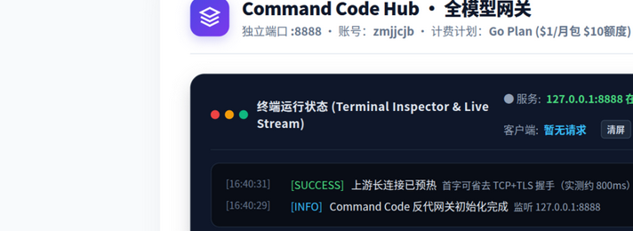
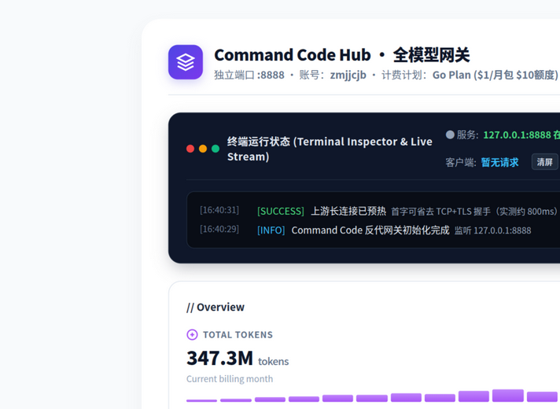
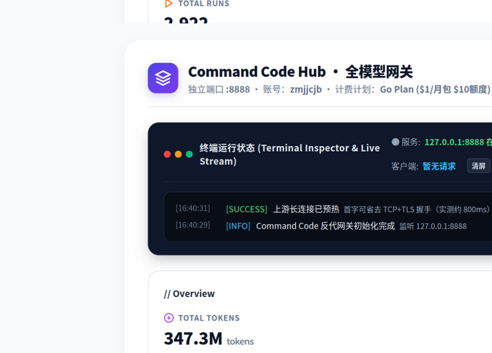
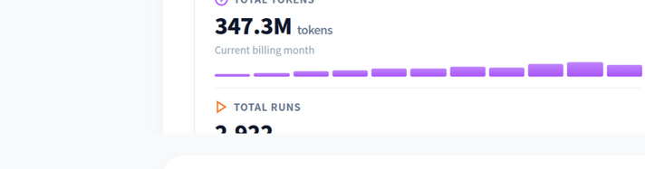

# cmdc-hub

Command Code 全模型网关 — 单文件可执行版。把 OpenAI 兼容请求转换为 Command Code 专有协议，零依赖、双击即跑、自动弹浏览器面板。



## 特性

- **零依赖单文件**：打包成 45MB 的独立可执行文件，目标机器不需要装 Node.js
- **启动即开浏览器**：双击运行后自动弹出 Dashboard 面板，无需手动打开网址
- **全模型聚合**：38+ 款模型统一走 OpenAI `/v1/chat/completions` 协议（Go 计划）
- **首字延迟优化**：自管 keepAlive 长连接池 + 启动预热 + 空闲补预热，复用连接省 ~800ms 握手
- **断流自愈**：未吐正文时内部重试（最多 3 次），已吐正文自动跨轮续传（最多 5 轮）
- **实时 Dashboard**：终端日志、首字延迟、缓存命中率、思考/正文比、续传轮次全监控
- **额度看板**：5 小时 / 周 / 月限额实时展示，全模型容量对比柱状图
- **缓存计费核算**：柱状图支持切换缓存命中率（0% / 50% / 80%），直观对比不同对话模式下的真实性价比
- **三栏价格展示**：模型列表同时显示输入价 / 输出价 / 缓存读价，缓存读用绿色高亮

## 截图








### 缓存命中率切换

柱状图工具栏支持三档缓存命中率切换，直观对比不同场景下的真实可用次数：

- **新对话 0%** — 每次都是全新输入，纯输入价计费
- **中等 50%** — 一半输入命中缓存，混合场景
- **长对话 80%** — 大部分历史消息走缓存，agent 长对话典型场景

单次成本公式：`新输入 × 输入价 + 缓存命中 × 缓存读价 + 输出 × 输出价`

## 使用前提

使用本软件前，需先购买 **Command Code Go 订阅**，且下载后至少登录一次：

① 先安装 command code 程序：
```bash
npm i -g command-code
```

② 安装好之后登录一次：
```bash
cmdc
```

③ 登录完之后 `Ctrl+C` 退出 command code

> 登录后凭据会自动保存到 `~/.commandcode/auth.json`，本网关服务依赖该文件获取你的账号信息。

## 快速开始

### 方式一：直接下载可执行文件（推荐）

从 [Releases](https://github.com/zmjjcjb/cmdc-hub/releases) 下载对应平台的文件：

**Linux:**
```bash
chmod +x cmdc-hub
./cmdc-hub
```

**Windows:**
```
双击 cmdc-hub.exe
```

启动后浏览器自动打开 `http://127.0.0.1:8888`。

### 方式二：图形化启动（源码方式，推荐日常使用）

`launcher/` 目录下提供了带图标的桌面快捷方式启动器，点一下就拉起服务并打开 Dashboard，不用每次开命令行。

**Linux（GNOME / KDE 等）：**
```bash
# 图标已经自动生成，直接装快捷方式：
cp ~/.local/share/applications/cmdc-hub.desktop ~/桌面/
# 或者直接双击 launcher/start.sh 运行
```

**Windows：**
```
1. 进入 launcher 目录
2. 双击 install_shortcut.bat 安装桌面和开始菜单快捷方式
3. 以后双击桌面上的 cmdc-hub 图标即可启动
```

启动脚本是幂等的：服务没运行就拉起，已运行就只打开面板，不会重复启动。

**文件说明：**

| 文件 | 用途 |
|------|------|
| `launcher/start.sh` | Linux 启动脚本 |
| `launcher/start.bat` | Windows 启动脚本 |
| `launcher/stop.bat` | Windows 停止脚本 |
| `launcher/install_shortcut.bat` | Windows 安装桌面/开始菜单快捷方式 |
| `launcher/make_icon.py` | 图标生成脚本（PIL） |
| `launcher/cmdc-hub.ico` | Windows 多尺寸图标 |
| `launcher/cmdc-hub.png` | Linux 图标 |

### 方式三：从源码直接运行

需要 Node.js ≥ 18：
```bash
git clone https://github.com/zmjjcjb/cmdc-hub.git
cd cmdc-hub
node cmdc-server.mjs
```

## 配置凭据

服务从 `~/.commandcode/auth.json` 读取你的 Command Code 凭据：

```json
{
  "apiKey": "你的 API Key",
  "userId": "你的用户 ID",
  "userName": "你的名字"
}
```

把文件放到你的用户目录下即可，服务启动时自动加载。

## 下游客户端配置

把客户端（ZCode、Cursor 等）的 OpenAI 兼容接口指向本地：

| 配置项 | 值 |
|--------|-----|
| Base URL | `http://127.0.0.1:8888/v1` |
| API Key | `local-proxy`（任意值均可） |

## 从源码打包

```bash
# 安装 pkg
npm install pkg

# Linux
npx pkg . --targets node18-linux-x64 --output dist/cmdc-hub

# Windows
npx pkg . --targets node18-win-x64 --output dist/cmdc-hub.exe
```

## 技术细节

| 项目 | 说明 |
|------|------|
| 源码 | 单文件 `cmdc-server.mjs`，约 2480 行 |
| 依赖 | 零外部依赖，仅 Node.js 内置模块 |
| 端口 | 默认 8888，被占用自动 +1 |
| 协议 | 入站 OpenAI `/v1/chat/completions` → 出站 Command Code wire 协议 |
| 流式 | 完整 SSE 双向转换，含工具调用、思考内容、断流续传 |
